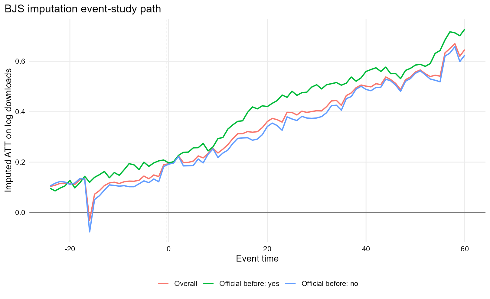
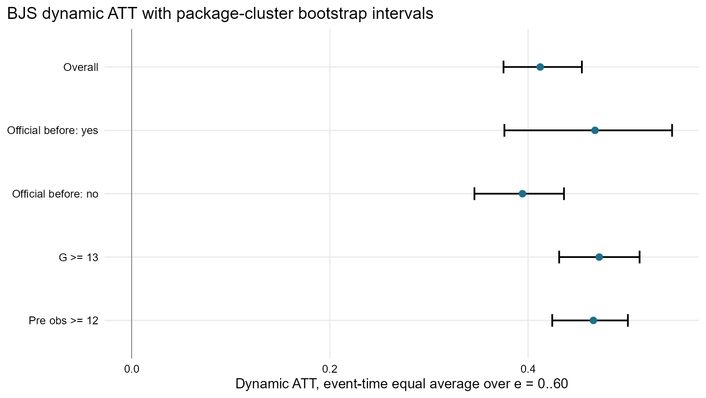
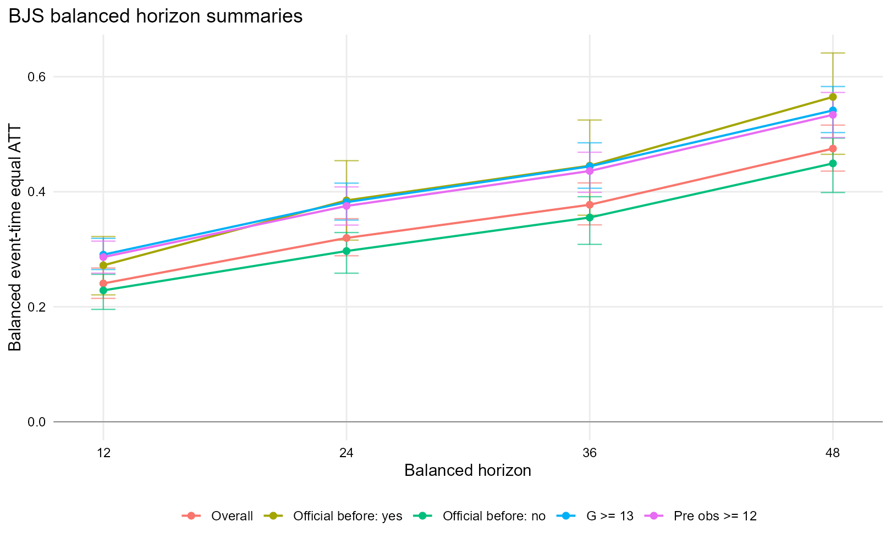
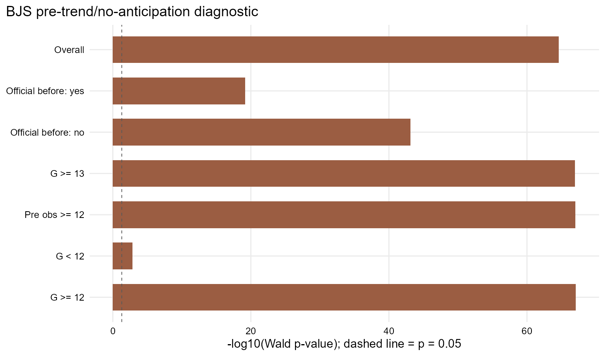
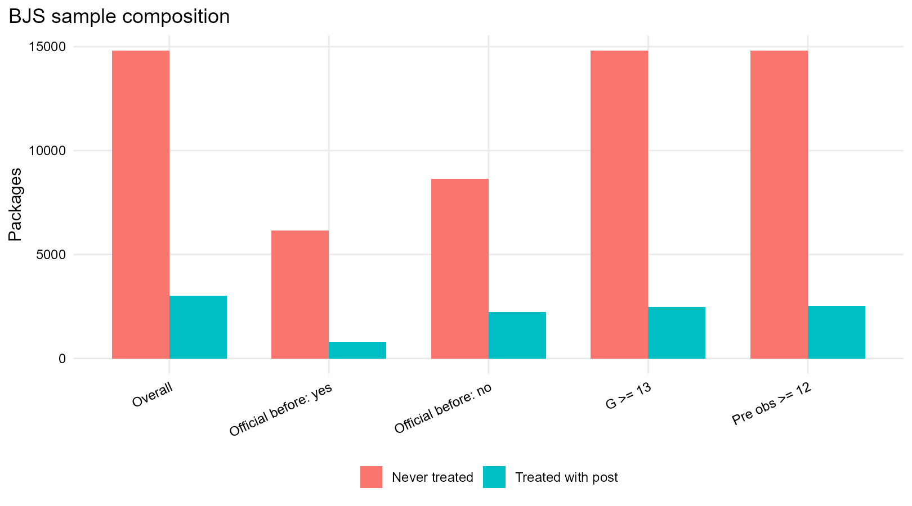

# BJS imputation v1 result report

作成日: 2026-06-28

このレポートは、`analysis/script/method_bjs_imputation_v1.R` の出力を、論文・発表で確認しやすい形に整理したものである。イベントはC&S DIDと同じく、CRANパッケージと同名の非公式GitHubリポジトリが初めて出現した時点である。アウトカムは月次CRANダウンロード数の対数 `log_dl` である。

## 1. BJS imputationで何を推定しているか

BJS imputationでは、まず未処置観測だけを使って、処置がなかった場合のダウンロード数を予測する。今回の主仕様では、未処置アウトカムをパッケージ固定効果と時点固定効果で表す。

```text
log_dl_it = alpha_i + lambda_t + error_it
```

このモデルを `G == 0` または `period < G` の観測だけで推定し、処置後の観測について反実仮想 `y0_hat_it` を補完する。BJSの処置効果は、実際の `log_dl_it` と補完された未処置アウトカムの差として計算する。

```text
tau_hat_it = log_dl_it - y0_hat_it
```

主な推定量は、イベント後 `e = 0..60` の平均である。`dynamic_att_event_equal_0_60` はイベント時点セルを等しく重みづけする平均、`dynamic_att_obs_weighted_0_60` は観測数で重みづけする平均である。このレポートでは、C&S DIDとの比較を意識して、主に event-time equal の値を中心に読む。

## 2. 推論と注意点

今回のBJS推論は package-cluster bootstrap による。bootstrapは `499` 回で、論文向けに使えるbootstrap推論は `利用可能` である。これはBJS論文のclosed-form conservative variance estimatorそのものではなく、パッケージ単位で再標本化してBJS推定を繰り返した実務的なbootstrap SEとして報告する。

一方、`bjs_dynamic_all.csv` に含まれる `se_naive` は記述的な診断用であり、論文での主な信頼区間としては使わない。

## 3. 仕様とサンプルの意味

`overall` は、G<12を除外しない主分析である。`official_before_yes` と `official_before_no` は、イベント前にCRAN/GitHub間の導線が確認されていたかどうかで分けたsubgroup分析である。`gte13` はイベント前に少なくとも12期程度の観測を持つパッケージに絞った感度分析であり、`preobs_ge12` は実際の処置前観測数が12以上あるものに絞る感度分析である。

重要なのは、BJSの主モデルには `official_before_yes` や `preobs_ge12` を共変量として直接入れているわけではない点である。パッケージ固定効果を入れるため、時間不変に近い変数は固定効果と重なりやすい。そこで、BJSでは未処置アウトカムモデルを同じ形に保ったまま、サンプルを分けて結果が変わるかを見る。

## 4. 主な結論

第一に、全体サンプルのBJS Dynamic ATTは `0.4123` であり、95% bootstrap CIは `[0.3752, 0.4543]` である。対数値を概算の割合に直すと約 `51.0%` であり、同名非公式GitHubリポジトリ出現後にCRANダウンロードが高いという正の関連が確認される。

第二に、イベント前にCRAN/GitHub間の公式誘導に相当する導線がある `official_before_yes` では ATT が `0.4675`、導線がない `official_before_no` では `0.3944` である。BJSでも official_before_yes の方が大きい。これは、事前に可視性・導線を持つパッケージほど、同名非公式リポジトリ出現後のDL水準も高いことを示す。

第三に、`G >= 13` に限定した感度分析では ATT が `0.4718`、`preobs_ge12` では `0.4659` である。したがって、処置前観測が短いパッケージを除いても正の結果は残る。

ただし、BJSのpre-trend/no-anticipation diagnosticでは、主要サンプルでWald検定が強く棄却されている。したがって、結果は「同名非公式リポジトリ出現後にDLが増える」という頑健な記述的・準因果的な関連としては強いが、純粋な因果効果として断定するには慎重であるべきである。

## 5. 主要図

### 図1: BJS event-study path

<p align="center"></p>

この図は、BJS imputation residualをイベント時点ごとに平均した動学パスである。イベント後は全体として正の値が続き、時間が進むほど大きくなる傾向がある。official_before_yes は official_before_no より高い水準で推移している。ただし、イベント前にも正の残差が見られるため、処置前から対象群に差があった可能性を示している。

### 図2: Dynamic ATTのbootstrap CI

<p align="center"></p>

この図は、`e = 0..60` の平均Dynamic ATTを仕様別に比較したものである。全仕様で信頼区間は0を上回っている。特に `official_before_yes`、`G >= 13`、`preobs_ge12` の推定値が大きい。

### 図3: Balanced horizon summary

<p align="center"></p>

balanced horizonは、イベント後12、24、36、48期まで観測できるパッケージに限定して平均効果を見るものである。horizonが長くなるほどATTが大きくなっており、短期だけでなく中長期にもDL水準の差が広がるパターンが見られる。

### 図4: Pre-trend/no-anticipation diagnostic

<p align="center"></p>

この図は、BJSのpre-trend/no-anticipation diagnosticのWald p値を `-log10(p)` で示したものである。破線より右にあるほど5%水準で棄却される。主要サンプルではすべて棄却されており、処置前の動きが完全に揃っていたとは言いにくい。

### 図5: Sample composition

<p align="center"></p>

この図は、各仕様で使われたtreated with postとnever-treatedの件数を示している。official_before_yes/no の分割ではサンプルサイズが大きく異なるため、推定値の精度や解釈にも注意が必要である。

## 6. Main BJS estimates

| Specification | Treated packages | With post obs | ATT | SE | 95% CI | % approx. | Bootstrap |
| --- | --- | --- | --- | --- | --- | --- | --- |
| Overall | 3,262 | 3,024 | 0.4123 | 0.0199 | [0.3752, 0.4543] | 51.0% | 499/499 |
| Official before: yes | 852 | 792 | 0.4675 | 0.0414 | [0.3761, 0.5453] | 59.6% | 499/499 |
| Official before: no | 2,410 | 2,232 | 0.3944 | 0.0230 | [0.3459, 0.4363] | 48.3% | 499/499 |
| G >= 13 | 2,712 | 2,476 | 0.4718 | 0.0215 | [0.4314, 0.5126] | 60.3% | 499/499 |
| Pre obs >= 12 | 2,759 | 2,523 | 0.4659 | 0.0196 | [0.4244, 0.5007] | 59.3% | 499/499 |

上表の `% approx.` は `exp(ATT)-1` による概算である。BJSのATTは対数ダウンロード数の差なので、厳密にはログスケールの差として読むのが基本である。

## 7. Balanced horizon estimates

| Specification | Horizon | ATT | SE | 95% CI |
| --- | --- | --- | --- | --- |
| Overall | h12 | 0.2406 | 0.0136 | [0.2146, 0.2675] |
| Overall | h24 | 0.3197 | 0.0160 | [0.2887, 0.3531] |
| Overall | h36 | 0.3774 | 0.0187 | [0.3424, 0.4153] |
| Overall | h48 | 0.4750 | 0.0209 | [0.4359, 0.5158] |
| Official before: yes | h12 | 0.2720 | 0.0266 | [0.2207, 0.3221] |
| Official before: yes | h24 | 0.3849 | 0.0343 | [0.3159, 0.4540] |
| Official before: yes | h36 | 0.4453 | 0.0402 | [0.3592, 0.5247] |
| Official before: yes | h48 | 0.5649 | 0.0448 | [0.4650, 0.6412] |
| Official before: no | h12 | 0.2285 | 0.0153 | [0.1955, 0.2564] |
| Official before: no | h24 | 0.2969 | 0.0184 | [0.2584, 0.3291] |
| Official before: no | h36 | 0.3552 | 0.0213 | [0.3085, 0.3914] |
| Official before: no | h48 | 0.4492 | 0.0232 | [0.3987, 0.4932] |
| G >= 13 | h12 | 0.2905 | 0.0146 | [0.2648, 0.3189] |
| G >= 13 | h24 | 0.3819 | 0.0169 | [0.3508, 0.4150] |
| G >= 13 | h36 | 0.4441 | 0.0198 | [0.4060, 0.4851] |
| G >= 13 | h48 | 0.5414 | 0.0222 | [0.5029, 0.5830] |
| Pre obs >= 12 | h12 | 0.2864 | 0.0140 | [0.2585, 0.3142] |
| Pre obs >= 12 | h24 | 0.3753 | 0.0169 | [0.3420, 0.4084] |
| Pre obs >= 12 | h36 | 0.4361 | 0.0193 | [0.3989, 0.4687] |
| Pre obs >= 12 | h48 | 0.5337 | 0.0205 | [0.4942, 0.5726] |

balanced horizonでは、観測可能な期間が十分にあるパッケージに対象が限定される。そのため、長期horizonほどサンプル構成が変わる可能性がある。ただし、今回の結果ではh12からh48にかけて一貫して正であり、horizonが長いほど推定値が大きい。

## 8. Pre-trend diagnostic

| Specification | Lead k | Clusters | Wald p | Mean pre residual | Max abs pre residual | Pre cells |
| --- | --- | --- | --- | --- | --- | --- |
| Overall | 12 | 18,064 | <0.001 | 0.1160 | 0.1892 | 24 |
| Official before: yes | 12 | 7,005 | <0.001 | 0.1502 | 0.2085 | 24 |
| Official before: no | 12 | 11,059 | <0.001 | 0.1051 | 0.1823 | 24 |
| G >= 13 | 12 | 17,514 | <0.001 | 0.1248 | 0.2231 | 24 |
| G < 12 | 12 | 15,304 | 0.001 | -0.0467 | 0.3234 | 11 |
| G >= 12 | 12 | 17,562 | <0.001 | 0.1234 | 0.2207 | 24 |
| Pre obs >= 12 | 12 | 17,561 | <0.001 | 0.1234 | 0.2204 | 24 |

BJSのpre-trend/no-anticipation testでは、処置前12期のlead係数が同時に0であるかを検定している。全体、official_before_yes、official_before_no、G>=13、preobs_ge12のいずれでもp値は非常に小さい。したがって、BJSでもC&Sと同様に、処置前差の存在を明示したうえで結果を解釈する必要がある。

## 9. Sample diagnostics

| Specification | Packages | Treated packages | Treated with post | Never treated | Untreated obs | Post treated obs | FE converged |
| --- | --- | --- | --- | --- | --- | --- | --- |
| Overall | 18,064 | 3,262 | 3,024 | 14,802 | 1,171,509 | 141,151 | Yes |
| Official before: yes | 7,005 | 852 | 792 | 6,153 | 445,572 | 34,687 | Yes |
| Official before: no | 11,059 | 2,410 | 2,232 | 8,649 | 725,937 | 106,464 | Yes |
| G >= 13 | 17,514 | 2,712 | 2,476 | 14,802 | 1,167,767 | 112,975 | Yes |
| Pre obs >= 12 | 17,561 | 2,759 | 2,523 | 14,802 | 1,168,331 | 115,379 | Yes |

FE推定はすべて収束している。全体ではtreated packageが3,262、そのうち処置後観測を持つものが3,024である。official_before_yesはtreated 852、official_before_noはtreated 2,410であり、official_before_yesはサンプルが小さい分、SEも大きい。

## 10. C&S DIDとの関係

C&S DIDは、群時点ATTを比較群の選び方や共変量調整とともに推定する方法である。一方、BJS imputationは、未処置観測だけで未処置アウトカムモデルを推定し、処置後の反実仮想を補完する方法である。両者は反実仮想の作り方が異なるため、同じ方向の結果が出るなら、特定の推定手法だけに依存した結果ではないと言いやすくなる。

今回、BJSでもC&Sと同じく、同名非公式GitHubリポジトリ出現後のDL増加、official_before_yesの大きめの推定値、処置前差への注意という3点が確認された。したがって、現時点の結論は次のようにまとめられる。

> 同名非公式GitHubリポジトリの出現後、CRANパッケージのダウンロード数は高い水準を示す。この関連はC&S DIDだけでなくBJS imputationでも確認され、G>=13やpreobs_ge12の感度分析でも残る。ただし、処置前の差も統計的に確認されるため、純粋な因果効果というより、パッケージの事前の可視性・人気・導線を含む関連として慎重に解釈する必要がある。

## 11. 次に確認すべき点

1. C&SとBJSの同じ仕様を横並びにした比較表を作り、推定値の差を整理する。
2. official_before_yes/no でpre-trendの形がどの時点から違うのかを、pre-event側だけの図で確認する。
3. BJSの結果をSDIDやcohort-specificな比較と照合し、反実仮想の作り方に依存しない部分を明確にする。
4. 論文本文では、bootstrap SEをpackage-cluster bootstrapとして記述し、BJS closed-form conservative SEとは書かない。

