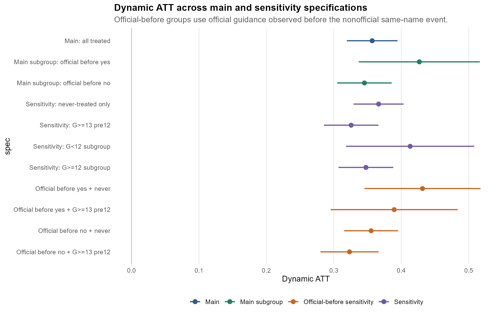
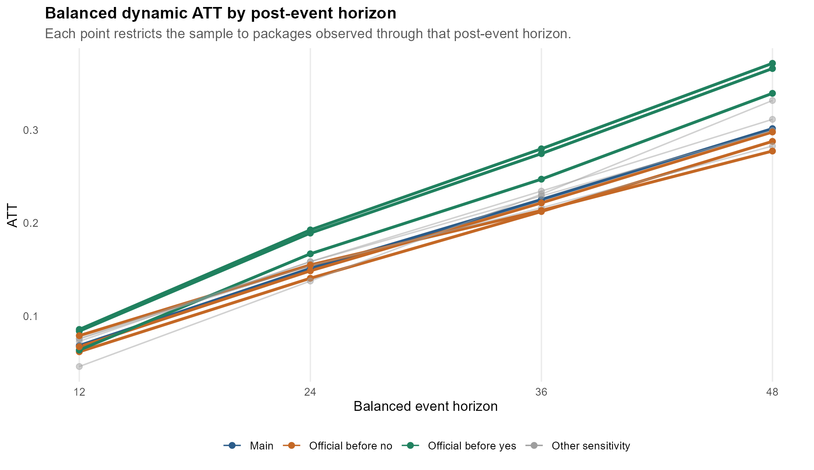
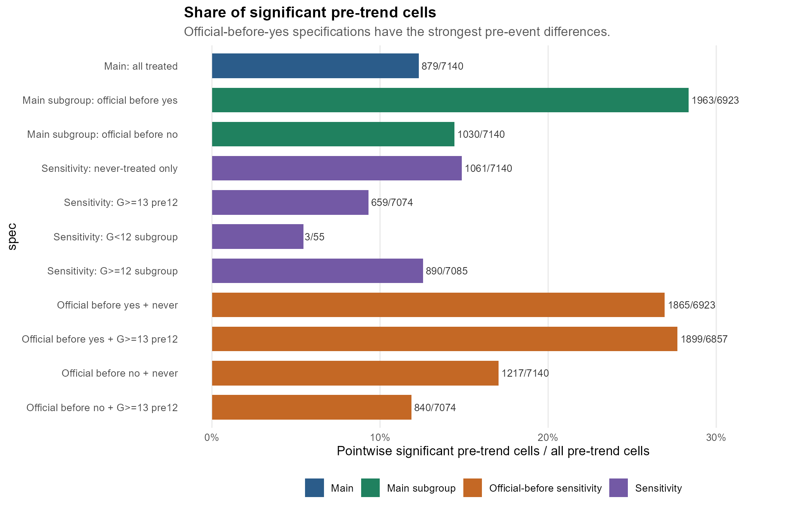

# CS2021 DID v8: Current Conclusion Report

作成日: 2026-06-05

このファイルは、現時点の推定結果から、発表・論文で中心に置くべき結論を整理したものである。詳細な仕様説明は `cs2021_did_v8_official_before_report.md` に譲り、ここでは「何が言えるか」「どの図表を見せるべきか」「どこに注意すべきか」を優先してまとめる。

## 1. 現時点の結論

現時点で最も安全に言える結論は、次の3点である。

第一に、CRANパッケージと同名の非公式GitHubリポジトリが出現した後、CRANダウンロード数は比較群に対して一貫して増加している。主分析の Dynamic ATT は 0.3569 であり、比較群を never-treated のみに限定しても 0.3664、イベント前12か月を観測できるパッケージに限定しても 0.3257 である。したがって、同名非公式リポジトリ出現後のDL増加という基本結果は、仕様変更に対してかなり安定している。

第二に、イベント前から公式誘導があるパッケージでは、イベント後のDL増加がより大きい。主分析では、`official_before_yes` の Dynamic ATT が 0.4268、`official_before_no` が 0.3454 である。これは、公式誘導がイベント前にあるパッケージほど、同名非公式リポジトリ出現後のDL増加が大きいことを示している。

第三に、ただし `official_before_yes` 群では pre-trend もかなり強い。つまり、この群は処置イベントの前から比較群と異なる動きをしていた可能性が高い。そのため、`official_before_yes` の大きなATTを「公式誘導の因果効果」と読むのは危険である。より安全には、公式誘導があるようなパッケージは、イベント前から可視性・人気・利用者導線が強い高可視性パッケージ群であり、その特徴が推定値に含まれている、と解釈する。

## 2. 分析の軸

今回のイベントは、あくまで「同名の非公式GitHubリポジトリが出たタイミング」である。公式誘導の出現タイミングはイベントではない。

```text
イベント:
  first_nonofficial_date
  = 同名非公式GitHubリポジトリの初出日

追加した変数:
  official_before_event
  = イベントより前に公式誘導が確認されていたか
```

したがって、この分析の問いは次のように表現できる。

> 同名の非公式GitHubリポジトリが出たあと、CRANダウンロード数は増えるのか。さらに、その増え方は、イベント前から公式誘導があるパッケージで異なるのか。

## 3. 主要図表

### 図1: Dynamic ATT の仕様間比較

<p align="center">
  
</p>

この図で最も重要なのは、すべての主要仕様で Dynamic ATT が正である点である。主分析だけでなく、never-treated only、G>=13 pre12、official_before_event 別の感度分析でも、推定値は一貫して0より大きい。

特に、主分析の 0.3569、never-treated only の 0.3664、G>=13 pre12 の 0.3257 が近い水準にあるため、基本結果は比較群の選び方や事前期間の制限だけで消えるものではない。

### 図2: Balanced Dynamic の推移

<p align="center">
  
</p>

Balanced Dynamic では、イベント後12、24、36、48か月まで観測できるパッケージに限定してATTを比較している。多くの仕様で、e12からe48にかけてATTが大きくなる。

これは、同名非公式リポジトリ出現後のDL増加が、イベント直後だけの一時的な変化ではなく、中長期的に広がるパターンである可能性を示している。

### 図3: Pre-trend の有意セル割合

<p align="center">
  
</p>

この図は、解釈上の注意点を示すために重要である。`official_before_yes` 系の仕様では、処置前の有意セル割合がかなり高い。

つまり、公式誘導がイベント前にある群は、処置後に大きく伸びるだけでなく、処置前からすでに比較群と異なる動きをしていた。この点を明示することで、結果の主張を強くしすぎず、説得力のある解釈にできる。

## 4. 主分析の結果

| 仕様 | treated数 | Dynamic ATT | SE | Group ATT | SE | Calendar ATT | SE |
|---|---:|---:|---:|---:|---:|---:|---:|
| 全体 | 3,262 | 0.3569 | 0.0192 | 0.3128 | 0.0174 | 0.2975 | 0.0169 |
| official before yes | 852 | 0.4268 | 0.0458 | 0.3749 | 0.0396 | 0.3721 | 0.0387 |
| official before no | 2,410 | 0.3454 | 0.0206 | 0.3014 | 0.0187 | 0.2851 | 0.0183 |

主分析では、全体の Dynamic ATT は 0.3569 である。対数DLの差として読むと、概算では `exp(0.3569)-1` により約43%程度の差に相当する。

`official_before_yes` は 0.4268、`official_before_no` は 0.3454 であり、公式誘導がイベント前にある群のほうが大きい。ただし、この差は公式誘導そのものの因果効果ではなく、イベント前からの可視性や人気の差を含んでいる可能性が高い。

## 5. 感度分析の結果

| 仕様 | treated数 | Dynamic ATT | SE | Group ATT | SE | Calendar ATT | SE |
|---|---:|---:|---:|---:|---:|---:|---:|
| never-treated only | 3,262 | 0.3664 | 0.0189 | 0.3212 | 0.0168 | 0.3077 | 0.0180 |
| G>=13 pre12 | 2,712 | 0.3257 | 0.0206 | 0.2779 | 0.0181 | 0.2757 | 0.0177 |
| G<12 subgroup | 502 | 0.4132 | 0.0485 | 0.4132 | 0.0460 | 0.4171 | 0.0442 |
| G>=12 subgroup | 2,760 | 0.3476 | 0.0207 | 0.2973 | 0.0188 | 0.3006 | 0.0188 |

感度分析からは、主結果の頑健性が確認できる。比較群を never-treated のみにしても、Dynamic ATT は 0.3664 と主分析とほぼ同じである。また、G>=13 pre12 では 0.3257 とやや小さくなるが、依然として正で有意である。

`G<12 subgroup` は 0.4132 と大きいが、treated数が502と小さく、pre-trendセルも少ないため、中心的な結論ではなく補助的な結果として扱うのがよい。

## 6. official_before_event 別の結果

| 仕様 | treated数 | Dynamic ATT | SE | Group ATT | SE | Calendar ATT | SE |
|---|---:|---:|---:|---:|---:|---:|---:|
| official before yes + never | 852 | 0.4315 | 0.0439 | 0.3788 | 0.0420 | 0.3770 | 0.0394 |
| official before yes + G>=13 pre12 | 699 | 0.3895 | 0.0481 | 0.3302 | 0.0433 | 0.3108 | 0.0411 |
| official before no + never | 2,410 | 0.3553 | 0.0204 | 0.3102 | 0.0182 | 0.2963 | 0.0197 |
| official before no + G>=13 pre12 | 2,013 | 0.3233 | 0.0220 | 0.2749 | 0.0194 | 0.2763 | 0.0190 |

`official_before_yes` 群は、never-treated only でも G>=13 pre12 でも `official_before_no` 群より大きい。これは、公式誘導がイベント前にあるパッケージでは、イベント後のDL増加が大きいというパターンが仕様変更後も残ることを示す。

一方で、`official_before_no` 群でも Dynamic ATT は 0.3553 と 0.3233 であり、どちらも正である。これは重要である。結果が公式誘導あり群だけに依存しているわけではなく、公式誘導がイベント前にない群でも、同名非公式GitHubリポジトリ出現後のDL増加が確認できる。

## 7. Pre-trend の確認

| 仕様 | pre-trendセル | 有意セル | 有意セル割合 | Wald p |
|---|---:|---:|---:|---:|
| 全体 | 7,140 | 879 | 12.3% | 0.0000 |
| official before yes | 6,923 | 1,963 | 28.4% | 0.0000 |
| official before no | 7,140 | 1,030 | 14.4% | 0.0000 |
| never-treated only | 7,140 | 1,061 | 14.9% | 0.0000 |
| G>=13 pre12 | 7,074 | 659 | 9.3% | 0.0000 |
| official before yes + never | 6,923 | 1,865 | 26.9% | 0.0000 |
| official before yes + G>=13 pre12 | 6,857 | 1,899 | 27.7% | 0.0000 |
| official before no + never | 7,140 | 1,217 | 17.0% | 0.0000 |
| official before no + G>=13 pre12 | 7,074 | 840 | 11.9% | 0.0000 |

pre-trend は今回の分析で最も注意すべき点である。特に `official_before_yes` は、有意セル割合が 28.4% と高い。これは `official_before_no` の 14.4% の約2倍である。

したがって、`official_before_yes` の大きなATTは、「公式誘導があったからDLが増えた」というより、「公式誘導があるような高可視性パッケージは、イベント前からDLが伸びやすく、イベント後もさらに大きく伸びる」と解釈するのが適切である。

一方で、`official_before_no` 群でもATTが正であるため、主結果は公式誘導あり群だけに支えられているわけではない。この点を発表では強調するとよい。

## 8. 発表・論文での言い方

現時点では、次の表現が最も妥当である。

> CRANパッケージと同名の非公式GitHubリポジトリが出現した後、CRANダウンロード数は比較群に対して一貫して増加する。この傾向は、比較群を never-treated に限定した場合や、イベント前12か月を観測できるサンプルに限定した場合でも維持される。特に、イベント前から公式誘導を持つパッケージでは増加幅が大きい。ただし、この群では処置前からDL成長の差が強く、推定値にはパッケージの事前の可視性・人気・導線の強さが含まれている可能性がある。

さらに短くまとめるなら、以下でよい。

> 同名非公式GitHubリポジトリの出現後、CRAN DLは増える。結果は複数の感度分析でも残る。ただし、公式誘導あり群では処置前から成長傾向が強いため、純粋な因果効果というより、可視性・人気を含んだ関連として解釈するのが妥当である。

## 9. 最終的な位置づけ

この分析の強みは、同名非公式GitHubリポジトリ出現後のDL増加が、複数の仕様で安定して確認できる点にある。

一方で、弱みは pre-trend である。特に公式誘導あり群では、処置前からDLの動きが異なる。そのため、結果を「完全な因果効果」として押し切るよりも、「GitHub上の同名非公式リポジトリ出現は、CRANパッケージの可視性・利用増加と強く結びついている」という実証的事実として提示する方が説得力がある。

結論としては、次の主張が最もバランスがよい。

> GitHub上でCRANパッケージと同名の非公式リポジトリが出現することは、そのパッケージのCRANダウンロード増加と強く関連している。この関連は感度分析でも頑健であり、イベント前から公式誘導がある高可視性パッケージでは特に大きい。ただし、処置前トレンドの存在から、推定値は純粋な因果効果ではなく、パッケージの事前の可視性や人気を含む関連として慎重に解釈する必要がある。

