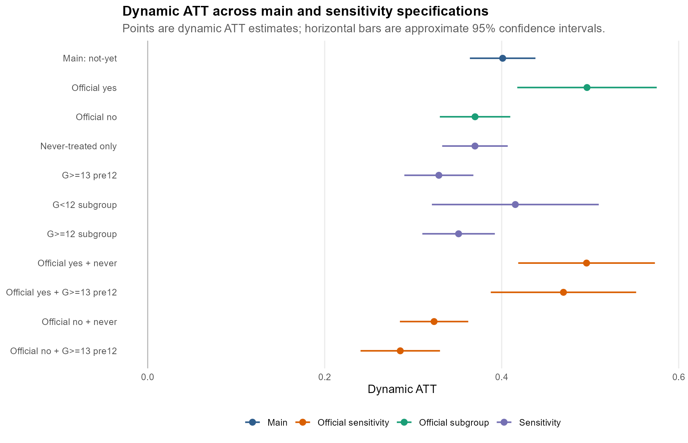
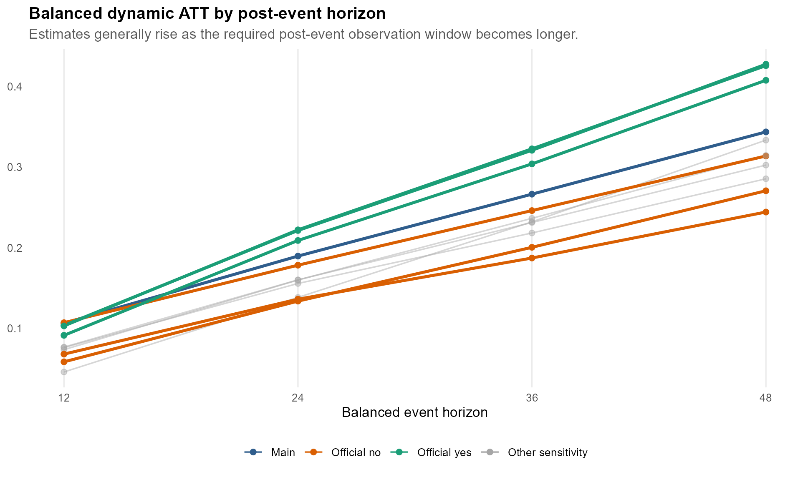
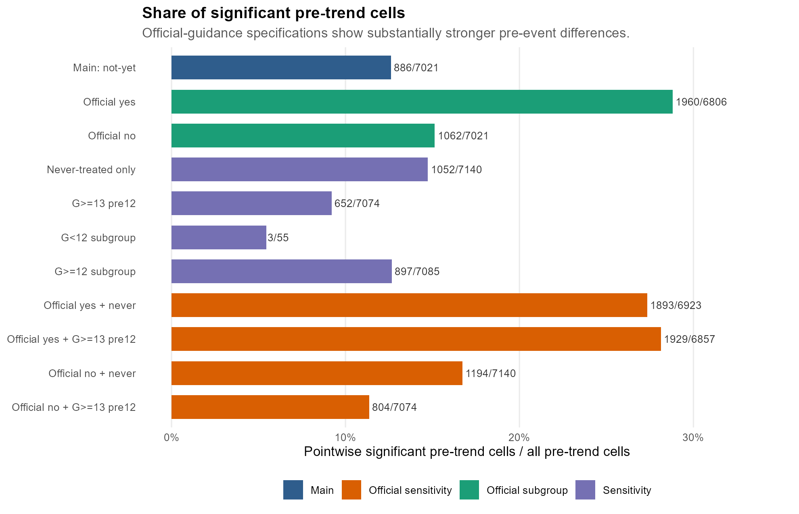

# CS2021 DID v8 Key Figure Report

作成日: 2026-05-12

このレポートは、`cs2021_did_v8_result_memo.md` のうち、特に重要な図だけを使って結果を読むための要約である。詳細な仕様説明・数値表・考察は本体メモを参照する。

## 1. 主要結果: Dynamic ATT は仕様を変えても正

  

この図は、主分析・通常 subgroup・感度分析の dynamic ATT を横並びで比較したものである。点が推定値、横線が約95%信頼区間を表す。

まず、すべての仕様でATTは正である。主分析では dynamic ATT が 0.4011、never-treated only では 0.3698、G>=13 pre12 では 0.3290 である。つまり、比較対象を never-treated のみに限定しても、処置前12期を観測できるパッケージに限定しても、同名GitHubリポジトリ出現後のCRANダウンロード増加という方向は維持されている。

また、official yes は official no より一貫して大きい。通常 subgroup では official yes が 0.4964、official no が 0.3699 であり、official yes/no に分けた感度分析でも、official yes + never が 0.4959、official no + never が 0.3236、official yes + G>=13 pre12 が 0.4698、official no + G>=13 pre12 が 0.2854 である。

この図から読める中心的な結果は、同名GitHub出現後のDL増加は多くの仕様で頑健に正であり、特に公式導線ありのパッケージで大きい、という点である。

## 2. 中長期の推移: 効果は時間とともに大きくなる

  

この図は、balanced dynamic ATT を e12, e24, e36, e48 の4時点で比較したものである。各線は、処置後その月数まで観測できるパッケージに限定したATTの推移を表す。

ほとんどの仕様で、ATTは e12 から e48 にかけて上昇している。主分析では 0.1063 から 0.3438 に、official yes では 0.1036 から 0.4278 に、official no では 0.1069 から 0.3139 に増えている。

このパターンは、同名GitHubリポジトリの出現がイベント月だけの一時的な増加として現れるというより、イベント後しばらく時間をかけてDL差が広がっていく可能性を示す。特に official yes 系の線は高めに推移しており、公式導線を伴うGitHubリポジトリでは中長期のDL増加がより大きいことが視覚的にも確認できる。

## 3. 注意点: official yes は pre-trend も強い

  

この図は、処置前のATTセルのうち、点ごとの検定で5%水準有意だったセルの割合を示している。値が大きいほど、処置前から処置群と比較群の動きが異なっていた可能性が高い。

主分析でも pre-trend は無視できないが、特に official yes 系で顕著である。通常 subgroup の official yes は 6806 セル中 1960 セルが有意であり、official yes + never は 6923 セル中 1893 セル、official yes + G>=13 pre12 は 6857 セル中 1929 セルが有意である。official no 系も有意セルはあるが、official yes 系ほど強くはない。

この図は、結果の因果解釈に対する重要な制約を示している。official yes のATTが大きいことは頑健だが、official yes 群は処置前からDLが伸びる傾向を持っていた可能性がある。したがって、「公式導線があるからDLが増えた」と断定するのではなく、「公式導線を伴う同名GitHubリポジトリを持つパッケージでは、処置前の水準・短期トレンドを調整しても、処置後により大きなDL増加が観測される」と表現するのが安全である。

## まとめ

図から得られる結論は三つである。

第一に、同名GitHubリポジトリの出現後、CRANダウンロードは比較群に対して相対的に増える。この結果は、主分析だけでなく、never-treated only や G>=13 pre12 といった感度分析でも維持される。

第二に、official yes は official no より一貫してATTが大きい。これは、公式導線を伴うGitHubリポジトリが、CRAN上の利用増加とより強く結びついていることを示す。

第三に、official yes では pre-trend も強い。したがって、結果は頑健な正の関連としては強いが、純粋な因果効果として主張するには慎重さが必要である。

発表・論文では、最初に主要ATTの比較図で頑健な正の関連を示し、次に balanced dynamic 図で中長期的な増加を示し、最後に pre-trend 図で解釈上の注意を明示する構成がわかりやすい。
