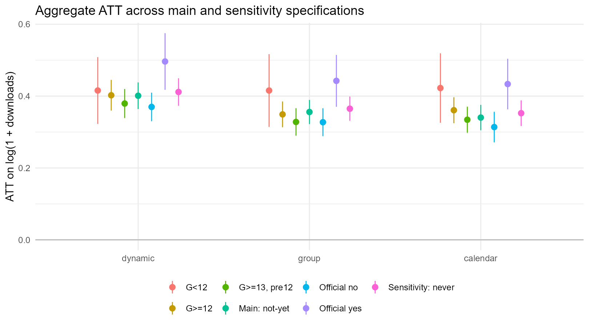
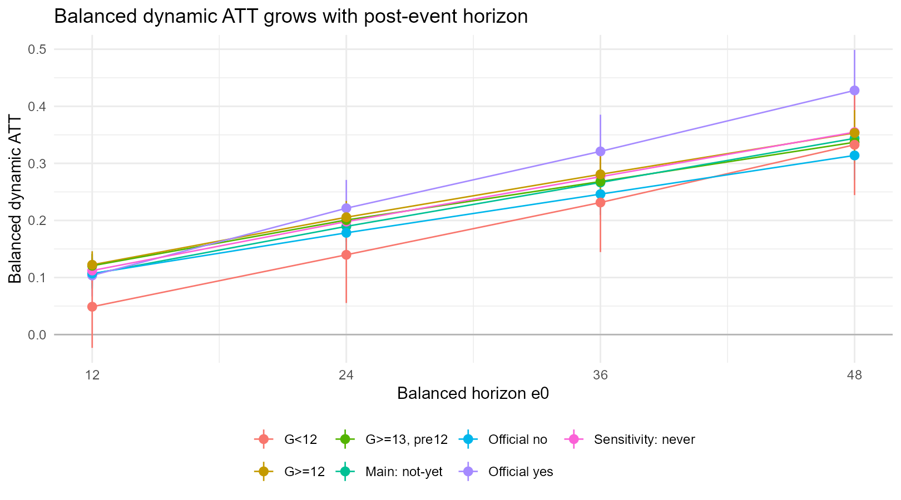

# CS2021 DID v8 Result Memo

Updated: 2026-05-09

## Estimation Setup

The outcome is `log(1 + monthly downloads)`. Treatment timing `G` is the first month in which a same-name GitHub repository is observed after CRAN publication.

The main specification estimates Callaway-Sant'Anna group-time ATT with `control_group = notyettreated`, `base_period = varying`, and covariates `official + log_dl_pre3 + pretrend_slope`. `baseline12` and `age_at_event` are not used in the main specification.

Dynamic effects are aggregated over `e = 0..60`. Balanced dynamic summaries are reported for `balance_e = 12, 24, 36, 48`.

## Role of the Main and Sensitivity Analyses

The main analysis is the baseline specification that carries the central interpretation of the study. It uses packages that have not yet experienced the same-name GitHub event as the comparison group, `control_group = notyettreated`, and adjusts for short-run pre-event download levels, `log_dl_pre3`, pre-event trends, `pretrend_slope`, and the official-guidance indicator, `official`. This specification keeps the sample broad while controlling for differences in pre-event scale and growth.

The standard subgroup analysis splits the main specification by official yes/no. Its purpose is to examine whether the post-event increase differs depending on whether the package has an official or clearly linked path from CRAN or package information to GitHub.

The sensitivity analyses are robustness checks. They ask whether the main result depends on particular specification choices. These checks restrict the control group to never-treated packages, restrict treated cohorts to `G>=13` and use pre12 covariates, split early and later cohorts into `G<12` and `G>=12`, and repeat the key checks separately for official yes and official no packages. Their role is not to create a separate main conclusion, but to assess whether the positive association and the official yes/no gap are sensitive to the choice of control group or the treatment of packages with short pre-event histories.

The intended reading order is therefore: first use the main specification to assess the overall direction and magnitude; then use the standard official yes/no subgroup analysis to compare package types; finally use the sensitivity analyses to check whether the sign, magnitude, and official yes/no ordering remain stable. In the current results, the ATT remains positive across sensitivity specifications, and official yes remains larger than official no. However, pre-trends, especially in the official-guidance subgroup, remain strong. The results should therefore be interpreted as a robust positive association rather than as a definitive causal effect.

## Main and Standard Subgroup Results

| Specification | Estimand | ATT | SE |
|---|---:|---:|---:|
| Main: not-yet | dynamic | 0.4011 | 0.0189 |
| Main: not-yet | group | 0.3558 | 0.0172 |
| Main: not-yet | calendar | 0.3403 | 0.0180 |
| Main: not-yet | balanced e12 | 0.1063 | 0.0111 |
| Main: not-yet | balanced e24 | 0.1896 | 0.0136 |
| Main: not-yet | balanced e36 | 0.2665 | 0.0171 |
| Main: not-yet | balanced e48 | 0.3438 | 0.0181 |
| Official yes | dynamic | 0.4964 | 0.0402 |
| Official yes | group | 0.4425 | 0.0368 |
| Official yes | calendar | 0.4336 | 0.0359 |
| Official yes | balanced e12 | 0.1036 | 0.0187 |
| Official yes | balanced e24 | 0.2214 | 0.0253 |
| Official yes | balanced e36 | 0.3210 | 0.0328 |
| Official yes | balanced e48 | 0.4278 | 0.0363 |
| Official no | dynamic | 0.3699 | 0.0203 |
| Official no | group | 0.3274 | 0.0198 |
| Official no | calendar | 0.3139 | 0.0217 |
| Official no | balanced e12 | 0.1069 | 0.0134 |
| Official no | balanced e24 | 0.1783 | 0.0171 |
| Official no | balanced e36 | 0.2461 | 0.0187 |
| Official no | balanced e48 | 0.3139 | 0.0220 |

The main dynamic ATT is 0.4011, indicating a relative increase in CRAN downloads after the appearance of a same-name GitHub repository. In the standard subgroup analysis, the official-guidance subgroup has a larger dynamic ATT than the no-guidance subgroup, 0.4964 versus 0.3699.

## Sensitivity Analyses

The latest run used `CS2021_SENSITIVITY_ONLY=1`, so it skipped the main and standard subgroup analyses and executed only the sensitivity specifications. All sensitivity specifications completed successfully.

| Specification | Control | Covariates | Dynamic ATT | SE |
|---|---|---|---:|---:|
| never-treated only | nevertreated | official + log_dl_pre3 + pretrend_slope | 0.3698 | 0.0189 |
| G>=13 pre12 | notyettreated | official + log_dl_pre12 | 0.3290 | 0.0199 |
| G<12 subgroup | notyettreated | official + log_dl_pre3 + pretrend_slope | 0.4154 | 0.0481 |
| G>=12 subgroup | notyettreated | official + log_dl_pre3 + pretrend_slope | 0.3513 | 0.0209 |
| official yes + never | nevertreated | log_dl_pre3 + pretrend_slope | 0.4959 | 0.0394 |
| official yes + G>=13 pre12 | notyettreated | log_dl_pre12 | 0.4698 | 0.0419 |
| official no + never | nevertreated | log_dl_pre3 + pretrend_slope | 0.3236 | 0.0197 |
| official no + G>=13 pre12 | notyettreated | log_dl_pre12 | 0.2854 | 0.0229 |

In the official yes/no subgroup specifications, `official` is constant within each subgroup and is therefore dropped from the covariate set. This is expected.

## Balanced Dynamic Sensitivity Results

| Specification | e12 | e24 | e36 | e48 |
|---|---:|---:|---:|---:|
| never-treated only | 0.0734 | 0.1599 | 0.2365 | 0.3145 |
| G>=13 pre12 | 0.0760 | 0.1556 | 0.2183 | 0.2856 |
| G<12 subgroup | 0.0457 | 0.1383 | 0.2321 | 0.3336 |
| G>=12 subgroup | 0.0766 | 0.1601 | 0.2313 | 0.3026 |
| official yes + never | 0.1029 | 0.2222 | 0.3228 | 0.4261 |
| official yes + G>=13 pre12 | 0.0912 | 0.2090 | 0.3041 | 0.4079 |
| official no + never | 0.0583 | 0.1337 | 0.2005 | 0.2707 |
| official no + G>=13 pre12 | 0.0679 | 0.1361 | 0.1872 | 0.2443 |

The balanced dynamic estimates increase from e12 to e48 in every specification. The pattern is more consistent with medium- to longer-run divergence than with a purely immediate jump at the event month.

## Pre-Trend Diagnostics

| Specification | Pre cells | p<0.05 cells | Wald p |
|---|---:|---:|---:|
| Main: not-yet | 7021 | 886 | <0.0001 |
| Official yes | 6806 | 1960 | <0.0001 |
| Official no | 7021 | 1062 | <0.0001 |
| never-treated only | 7140 | 1052 | <0.0001 |
| G>=13 pre12 | 7074 | 652 | <0.0001 |
| G<12 subgroup | 55 | 3 | 0.3536 |
| G>=12 subgroup | 7085 | 897 | <0.0001 |
| official yes + never | 6923 | 1893 | <0.0001 |
| official yes + G>=13 pre12 | 6857 | 1929 | <0.0001 |
| official no + never | 7140 | 1194 | <0.0001 |
| official no + G>=13 pre12 | 7074 | 804 | <0.0001 |

Pre-trends remain the central caveat. They are especially strong in the official-guidance subgroup, which means the post-event increase should not be interpreted mechanically as a pure causal effect of creating a same-name GitHub repository.

## Interpretation

The main specification shows a positive association between the appearance of a same-name GitHub repository and subsequent CRAN downloads. The dynamic ATT is 0.4011, and both group and calendar aggregations are also positive. The standard subgroup analysis shows a larger effect for official-guidance packages than for no-guidance packages.

The sensitivity analyses support the same qualitative conclusion. Restricting the control group to never-treated packages yields a dynamic ATT of 0.3698. Restricting treated cohorts to G>=13 and using the pre12 covariate specification yields 0.3290. The G<12 subgroup also has a large estimate, 0.4154, but it is less precise and has limited pre-treatment information, so it should be treated as supporting evidence rather than the main basis for the conclusion.

The official yes/no sensitivity analyses are particularly informative. The official-guidance subgroup remains larger under both never-treated controls and the G>=13 pre12 restriction: 0.4959 and 0.4698, respectively. The corresponding no-guidance estimates are 0.3236 and 0.2854. Thus, the larger estimate for official-guidance packages is not an artifact of the standard not-yet-treated control group alone.

However, the official-guidance subgroup also has very strong pre-trends. This is consistent with selection: packages that are already growing, more visible, or more actively maintained may be more likely to have official guidance to a same-name GitHub repository. The safest interpretation is therefore not that same-name GitHub creation mechanically causes downloads to rise, but that packages with a later same-name GitHub repository show a robust post-event relative increase even after controlling for pre-event download levels and short-run pre-event trends.

Overall, the results indicate a robust positive association between same-name GitHub repository appearance and CRAN download growth. This association is consistently larger for packages with official guidance, but the strong pre-trends, especially in the official-guidance subgroup, require cautious causal language.
